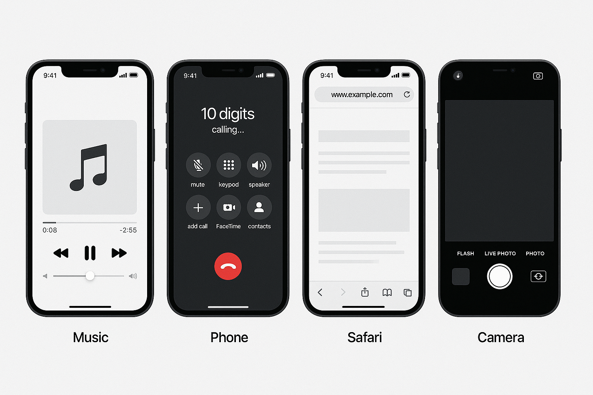

<h1 align="center">
   
  <br/>
  iPhoneSimulator - Simulador de iPhone em Java
</h1>

<p align="center">
  <em>Simulador completo das funcionalidades de um iPhone desenvolvido como projeto do <strong>Bootcamp Bradesco - Java Cloud Native</strong></em>
</p>

<p align="center">
  <a href="https://github.com/carlos0ff/iPhoneSimulator/issues">
  
</a>
  <a href="https://github.com/carlos0ff/iPhoneSimulator/stargazers">
    
  </a>
  <a href="https://github.com/carlos0ff/iPhoneSimulator/network/members">
    
  </a>
  <a href="https://github.com/carlos0ff/iPhoneSimulator/issues">
    
  </a>
  <a href="https://github.com/carlos0ff/iPhoneSimulator/blob/main/LICENSE">
    
  </a>
  <a href="https://java.com">
    
  </a>
</p>

---

## 🌟 Recursos Principais

### 🎵 Reprodutor Musical
- ▶️ Tocar, ⏸️ pausar e ⏹️ parar músicas
- 🔀 Seleção de faixas e playlists
- 🔊 Controle de volume equalizado
- 📻 Modos de reprodução (shuffle, repeat)

### 📞 Telefone
- 📲 Fazer/receber chamadas com histórico
- 👥 Gerenciamento de contatos
- 🗄️ Caixa postal virtual
- 🆔 Identificador de chamadas

### 🌐 Navegador Web
- 🔍 Motor de buscas integrado
- 📑 Navegação por abas
- ⏱️ Histórico e favoritos
- 🛡️ Modo privado

### 📱 Outros Aplicativos
| Ícone | Aplicativo      | Funcionalidades                     |
|-------|----------------|-------------------------------------|
| 📷    | Câmera         | Fotos e vídeos com filtros          |
| 📅    | Calendário     | Agenda e lembretes                  |
| ⏰    | Relógio        | Alarmes e cronômetro                |
| 🔒    | Segurança      | Face ID e autenticação biométrica   |

---

## 🎨 Demonstração

```java
// Exemplo de uso básico
iPhone meuiPhone = new iPhone();
meuiPhone.tocarMusica("Bohemian Rhapsody");
meuiPhone.ligar("11999999999");
```

---

## 🖼️ Screenshots
<div align="center">
   
</div>

---

## 🏗️ Arquitetura
```bash
iPhoneSimulator/
├── src/
│   └── com/
│       └── iphonesimulator/
│           ├── core/               # Componentes centrais
│           │   ├── Aparelho.java   # Classe base
│           │   ├── Bateria.java    # Gerenciamento de energia
│           │   └── Sistema.java    # Kernel do sistema
│           │
│           ├── apps/               # Aplicativos principais
│           │   ├── Musica/         # Reprodutor musical
│           │   ├── Telefone/       # Sistema de chamadas
│           │   ├── Navegador/      # Browser web
│           │   └── Camera/         # Sistema de câmera
│           │
│           ├── services/           # Serviços do sistema
│           │   ├── autenticacao/   # Face ID
│           │   ├── voz/            # Siri
│           │   └── notificacoes/   # Sistema de alertas
│           │
│           └── Main.java           # Ponto de entrada
│
├── assets/                         # Mídias e recursos
├── docs/                           # Documentação técnica
├── tests/                          # Testes unitários
└── README.md
```
---

## 🚀 Começando
- Pré-requisitos
- JDK 17+
- Git (opcional)

### Instalação
Clone o repositório:

```bash
# Clone o repositório (HTTPS)
git clone https://github.com/carlos0ff/iPhoneSimulator.git

# Alternativa via SSH (para quem configurou chaves SSH)
git clone git@github.com:carlos0ff/iPhoneSimulator.git

# Acesse o diretório do projeto
cd iPhoneSimulator

# Verifique a estrutura do projeto
ls -l
```
Compile o projeto:

```bash
javac -d bin src/main/java/com/iphonesimulator/*.java
```

Execute:

```bash
java -cp bin com.iphonesimulator.Main
```

---
## 🤝 Contribuição
Contribuições são bem-vindas! Siga estes passos:

- Faça um fork do projeto
- Crie uma branch
```bash
git checkout -b feature/nova-funcionalidade
```
- Commit suas mudanças
```bash
  git commit -m 'Adiciona nova funcionalidade'
```
- Push para a branch
```bash
 git push origin feature/nova-funcionalidade
```
- Abra um Pull Request 

--- 

## 📄 Licença
Este projeto está licenciado sob a Licença MIT - consulte o arquivo [LICENSE](LICENSE) para obter detalhes.

--- 

<p align="center"> Desenvolvido com ❤️ por <a href="https://github.com/carlos0ff">Carlos</a> </p>